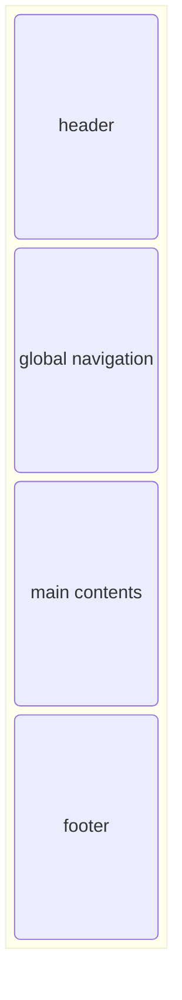

## コンテンツ構造

### サイトマップ

---
root:
  path: /
  description: 
  skelton: 
  contents:
    - 
 
---

### ページ内構造(skelton)
---
default:
  name 

---

### コンテンツ種別

- 記事
- 画像

## コンテンツモデル

## デザインコンセプト

### ワイヤーフレーム

- 1カラム

## 技術スタック
